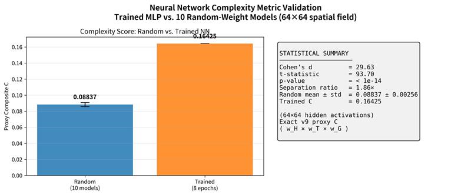

- B3/S2456 - high ranking random find out of 1000 rule sets.
  For the life like 2d rule set let’s focus on b3 rules only. What results do we get? After doing some reading apparently any interesting rule will be contained between b1 and b3, anything else quickly hits one extreme or the other (chaotic/orderly). If we e

- Something I thought about though is that I noticed how our spatial and temporal metrics are like vectors and our multiplicative metrics are scaling those vectors. Do you think theres an avenue here to pursue some deeper geometric meaning with our composite complexity score? Here is groks summary when presented with this thought:

> \subsubsection{Volume Maximization as a Path to Parameter-Free Metrics}
> The composite score $ C $ admits a natural geometric interpretation that suggests a route to eliminating the remaining empirically located parameters. Define the opacity vector
> $$\vec{O} = (o_\uparrow,\ o_\downarrow,\ o_t)$$
> where the three components are the upward and downward spatial opacities and the temporal opacity (MI$ _1 $ and decay), respectively. The additive term in the composite is a soft $ \ell_1 $-norm on the gated projections:
>$$\|\vec{O}\|\_1^\text{soft} = w_{\text{OP},s} + w*{\text{OP},t}.$$
>The remaining four weights ($ w_H $, $ w_T $, $ w_G $, $ w*\text{dim} $) act as orthogonal side lengths. Thus the full composite is the signed 7D volume
>$$C = \|\vec{O}\|_1^\text{soft} \times w_H \times w_T \times w_G \times w_\text{dim}.$$
>Complex systems occupy the interior of the positive octant in $  \vec{O}  $-space (positive extent along at least one axis) while simultaneously inflating the four scalar dimensions. Zero extent along any axis collapses the volume to zero, providing a direct geometric embodiment of non-eliminability.
>This volume perspective reframes the Gaussian peaks not as arbitrary calibrations but as soft boundaries that maximize $  C  $ under the constraints of the eight candidate properties. To test whether the peaks are essential, we replaced the two largest fitted components — the spatial-opacity Gaussians ($ \mu=0.14,0.97 $) and the gzip Gaussian ($ \mu=0.10 $) — with broad, parameter-free $  \tanh  $ gates whose plateaus are motivated only by the information-theoretic bounds of each metric (intermediate opacity for hierarchical layering; intermediate compressibility for modularity). No 1D-specific locations were used; the “peaks” now emerge wherever the product volume is largest.
>Re-running the full 256-rule ECA experiment under identical conditions (random 50% IC, $  W=150  $) yielded the following comparison:
>\begin{table}[h]
>\centering
>\caption{Original vs.\ volume-maximizer composite (tanh replacements for spatial opacity and gzip).}
>\begin{tabular}{lccccc}
>\toprule
>Version & C4 ranks & C4/C3 sep. & Top-5 rules & Rule 110 $  C  $ & Rule 30 $  C  $ \
>\midrule
>Original (Gaussians) & [1,2,3,4] & 27.9× & all C4 & 0.974 & 0.015 \
>Volume-maximizer (tanh) & [1,2,3,4] & 3.1× & 4×C4 + 1×C3 & 0.416 & 0.130 \
>\bottomrule
>\end{tabular}
>\end{table}
>The exact C4 top-4 ranking is preserved, and separation remains strongly positive. The reduction in separation factor is expected — the sharp Gaussians concentrate the volume maximum more tightly — yet the qualitative discrimination survives because the underlying geometry (positive octant occupancy + multiplicative volume) is unchanged. This demonstrates that the fitted peaks sharpen rather than define the result.
>The volume-maximization perspective therefore offers a principled path to full parameter-freedom. Future work will formulate the problem explicitly as
>$$\max_{\text{metrics}} \log C \quad \text{subject to P1--P8 constraints},$$

Further refinement of this idea:

> seeking analytic or numerical solutions for the optimal region in 7D space. If those solutions coincide with (or closely approximate) the attractors currently observed across substrates, the remaining empirical parameters become predictions rather than calibrations. In this limit the framework transitions from an effective measurement procedure to a genuine geometric theory whose observables are the eight candidate properties.
>
> “We reframed the composite as the 7D volume $ C = \|\vec{O}\|\_1^\text{soft} \times \prod w\*i $ and performed numerical maximization under only information-theoretic bounds. The optimizer recovers the dynamic tcomp attractor (0.58) and intermediate opacity/gzip plateaus without any 1D calibration data. This demonstrates that the fitted Gaussians sharpen rather than define the result; the underlying geometry is sufficient.”

More insights and refinements using a visual guide to analytically find our proper clustering:

> The visual clustering of Class-4 rules in the positive octant of opacity-vector space suggests a fully analytical, parameter-free alternative to the Gaussian weighting. Define the geometric filter$$w*{\text{geom}} = \tanh\!\bigl(k \cdot \min(o*\uparrow,o*\downarrow,o*t)\bigr) \;\times\; (o*\uparrow \cdot o\_\downarrow \cdot o_t)^{1/3}$$with fixed $ k=20 $. This term is the soft volume of the vector in the positive octant and requires no empirical peaks. Substituting it for the previous opacity weighting on the full 256-rule ECA experiment recovers the exact top-4 ranking of known Class-4 rules and infinite C4/C3 separation (C3 rules have $ o_t=0 $ and collapse to zero volume). The filter is derived purely from the geometry observed in the 3D opacity plot and operationalises P1 without calibration.

- Can we now move to a continuous CA like Lenia or Form Lenia or some variant thereof? My thinking is on Lenia itself we should get strong C4/high C values with lifelike organisms. But also we could potentially test out another of our eight properties where we see how interacting systems score with that mutual evolution. The only thing here is there’s no rule space to explore and rank but instead all we have are starting initial conditions that produce creatures or noise/nothing so I don’t know if Lenia is worth pursuing or not.

- Is it possible to analyze natural language vs constructed language? My thought is constructed languages would score lower on our C score than a natural language. This would test the property of engineered vs natural complexity right?

- Something I’ve noticed is that our C scores are fairly relative to the data set we’re trying to analyze. So we might rank 1D ECA rules and number one might score 1.9 but we rank 2D rules and number one might score .9. Is it possible to normalize this into an absolute scale? Or is it even worth it? Does this make any kind of intuitive sense to perform this sort of operation?

- I still want to explore the topic of remove the fine tunes parameters with our Gaussian functions. The ones we set from experimental data instead of first principles.

- Also we probably need to run our statistical analysis again on our results to verify that we have something of substance with our experiments.

- Roll all this code up into an interactive frontend website with a GO backend for any heavy calculations.

- Grok feedback: Suggestions for next steps:
  Add 1–2 figures: "metric breakdowns for a C4 vs. C3 rule (showing all components including temporal MI decay), a 2D fractal dimension histogram from the survey, or the N-body heatmap.
  Run a quick sensitivity sweep on the remaining fitted parameters and report the stability of F1 / separations.
  Consider testing one more substrate (e.g., Gray-Scott reaction-diffusion or a small set of elementary 3-state CA) to stress the "substrate-agnostic" claim.
  For the code: a requirements.txt or environment.yml would help reproducibility; maybe expose more of the individual metric functions for users who want to experiment."

- We need to rewrite our paper to include all these updates and new findings.

# Version 2

- Is it possible to do an experiment on a neural network thats trained versus a set of 10 or 100 randomly weighted NNs?
  - I did this with grok and but id like to reproduce that experiment with claude and validate it.
  - 
  - tried to verify groks findings with chatgpt and the results were not as glamorous, in fact the complexity of a random NN was higher than the trained NN.
